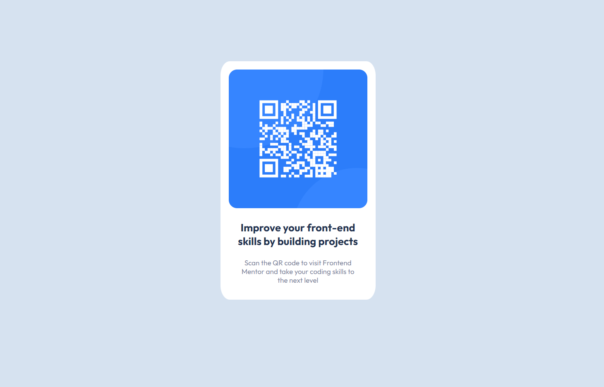

# Frontend Mentor - QR code component solution

This is a solution to the [QR code component challenge on Frontend Mentor](https://www.frontendmentor.io/challenges/qr-code-component-iux_sIO_H). Frontend Mentor challenges help you improve your coding skills by building realistic projects. 

## Table of contents

- [Overview](#overview)
  - [Screenshot](#screenshot)
  - [Links](#links)
- [My process](#my-process)
  - [Built with](#built-with)
  - [What I learned](#what-i-learned)
  - [Continued development](#continued-development)
  - [Useful resources](#useful-resources)

## Overview
A perfect first challenge if you're new to HTML and CSS. The card layout doesn't shift, so it's ideal if you haven't learned about building responsive layouts yet.
### Screenshot




### Links

- Solution URL: (https://github.com/joshua-estallo/qr-code-component/blob/main/index.html)
- Live Site URL: (https://joshua-estallo.github.io/qr-code-component/)

## My process

### Built with

- Semantic HTML5 markup
- CSS custom properties
- Flexbox


### What I learned

I acquired the skill of centering a container both vertically and horizontally by utilizing flexbox.

```css
.container {
  display: flex;
  justify-content: center;
  align-items: center;
}
```

### Continued development

The website requires further enhancements in responsiveness, particularly for smaller screens.

### Useful resources

- [CSS Pseudo-classes](https://www.w3schools.com/css/css_pseudo_classes.asp) - This helped me for targetting specific paragraphs in the container without adding a class to each paragraph element

